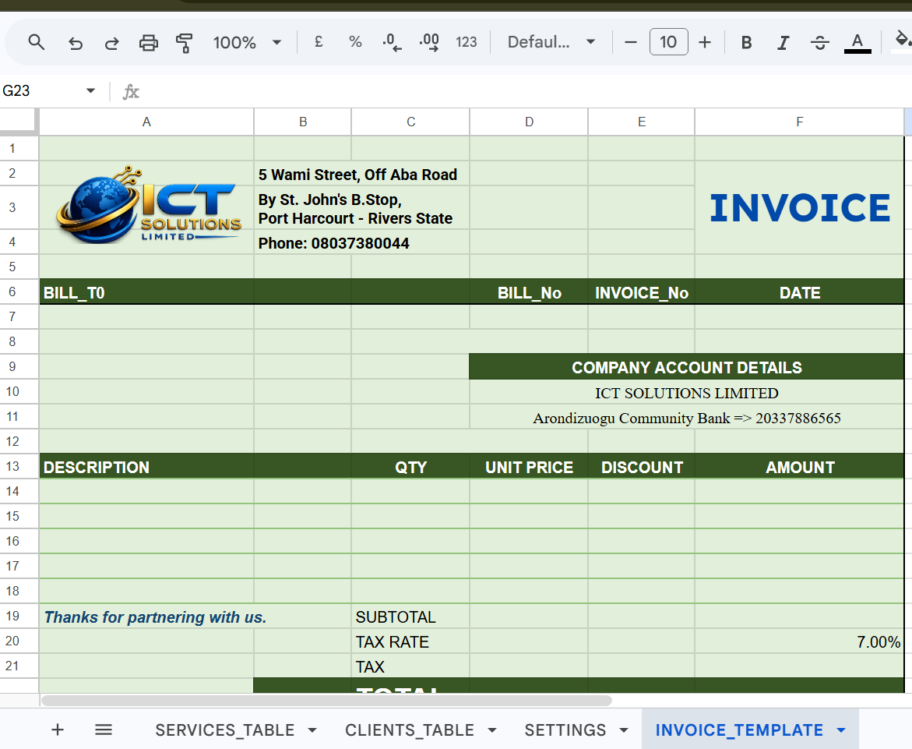
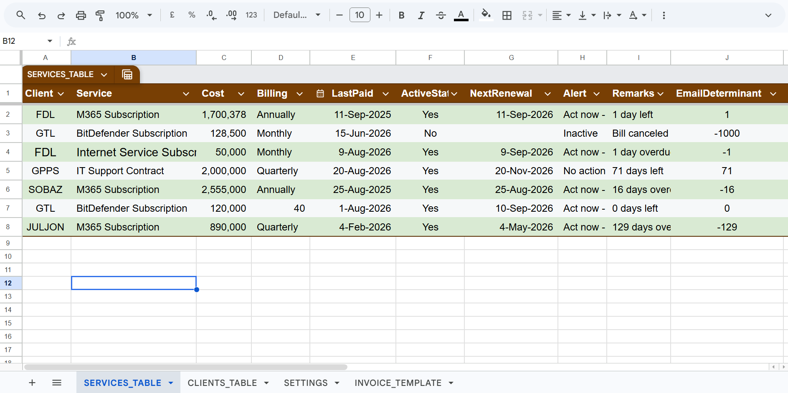
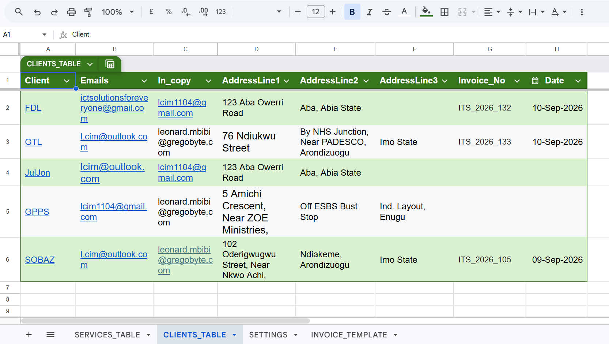
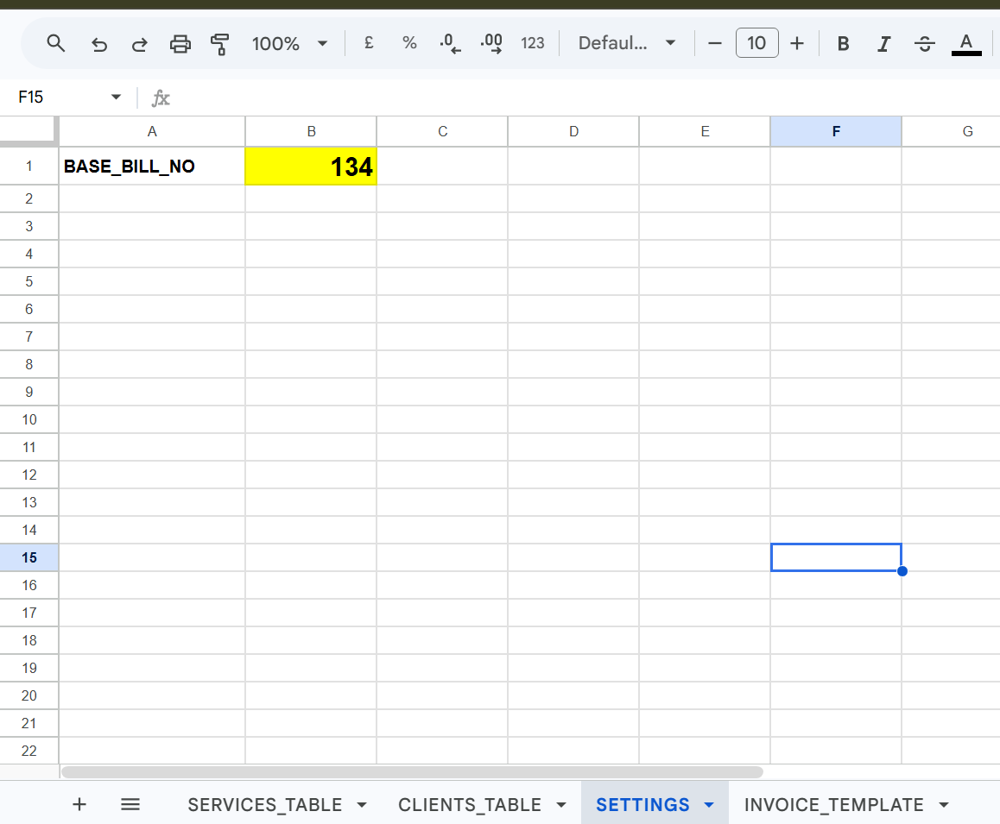
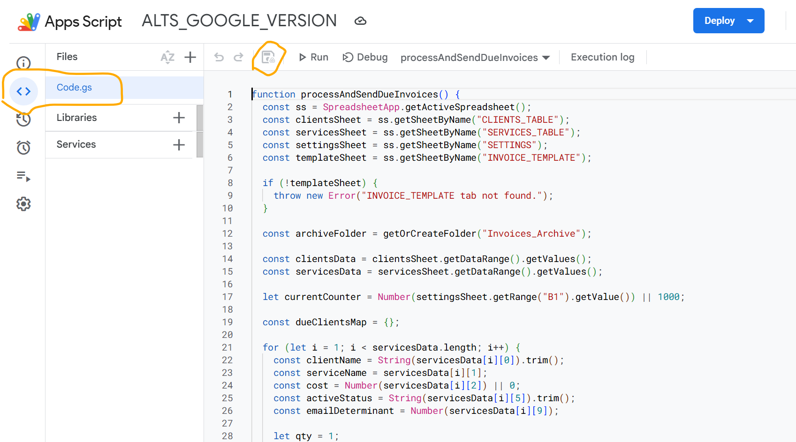
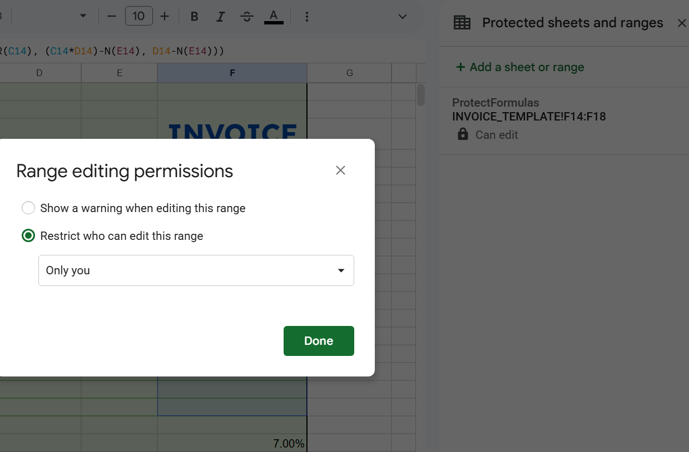

# Step-by-Step Deployment Guide: ALTS-GoogleVersion

This guide provides a detailed visual walkthrough for setting up and deploying the **Automated Lifecycle Tracking System (ALTS)** in Google Workspace.

---

## Step 1: Set Up the Google Sheet Schema
Create a new Google Sheet and set up the four required tabs (`SERVICES_TABLE`, `CLIENTS_TABLE`, `SETTINGS`, and `INVOICE_TEMPLATE`).

This is the invoice template. 

This is SERVICES table

This is CLIENTS table

This is SETTINGS tab for storing initial values

## Detailed Spreadsheet Formula Reference

Below are the exact formulas required to power the calculations across `SERVICES_TABLE` and `INVOICE_TEMPLATE`.

---

### 1. `SERVICES_TABLE` Formulas

To enable automated line-item tracking, place this formula in row 2 of Column `J` and extend it down the column:

| Column Name | Column | Formula / Value | Description |
| :--- | :---: | :--- | :--- |
| **EmailDeterminant** | `J` | `=INT(I2 - TODAY())` | Calculates integer days remaining until the renewal date in Column `I`. The Apps Script filters items where `-1 <= J <= 2`. |
| **QTY** | `K` | `1` *(Default)* | Hardcoded item quantity used for subtotal multiplication. |
| **Discount** | `L` | `0` *(Default)* | Fixed monetary value deducted from item subtotal before tax. |

---

### 2. `INVOICE_TEMPLATE` Formulas

Apply these formulas to the corresponding cells on the `INVOICE_TEMPLATE` sheet to ensure dynamic calculation when line items are populated:

| Cell / Range | Label | Formula | Description |
| :--- | :--- | :--- | :--- |
| `F14` to `F18` | **AMOUNT** | `=IF(OR(D14="", A14=""), "", IF(ISNUMBER(C14), (C14*D14)-N(E14), D14-N(E14)))` | Calculates item total based on Unit Price (`D`), Quantity (`C`), and Discount (`E`). |
| `F19` | **SUBTOTAL** | `=IF(F14="", "", SUM(F14:F18))` | Sums all active line item amounts. |
| `F20` | **TAX RATE** | `7.00%` | Standard local VAT rate. |
| `F21` | **TAX** | `=IF(F19="", "", F19 * F20)` | Computes tax amount based on subtotal. |
| `F22` | **TOTAL** | `=IF(F19="", "", F19 + F21)` | Final payable balance formatted for PDF export. |
---

## Step 2: Add Code to Google Apps Script
1. Open **Extensions > Apps Script**.
2. Paste the contents of `Code.gs` into the editor.
3. Save the project (💾 icon).

---

## Step 3: Configure Cell Protections
Protect formula cells on `INVOICE_TEMPLATE` (`F14:F22`) and the sequence counter on `SETTINGS` (`B1`).

---

## Step 4: Deploy Time-Driven Trigger
1. Click the **Triggers** icon (🕒) in the left sidebar.
2. Select **+ Add Trigger** and set it to run `processAndSendDueInvoices` daily.

