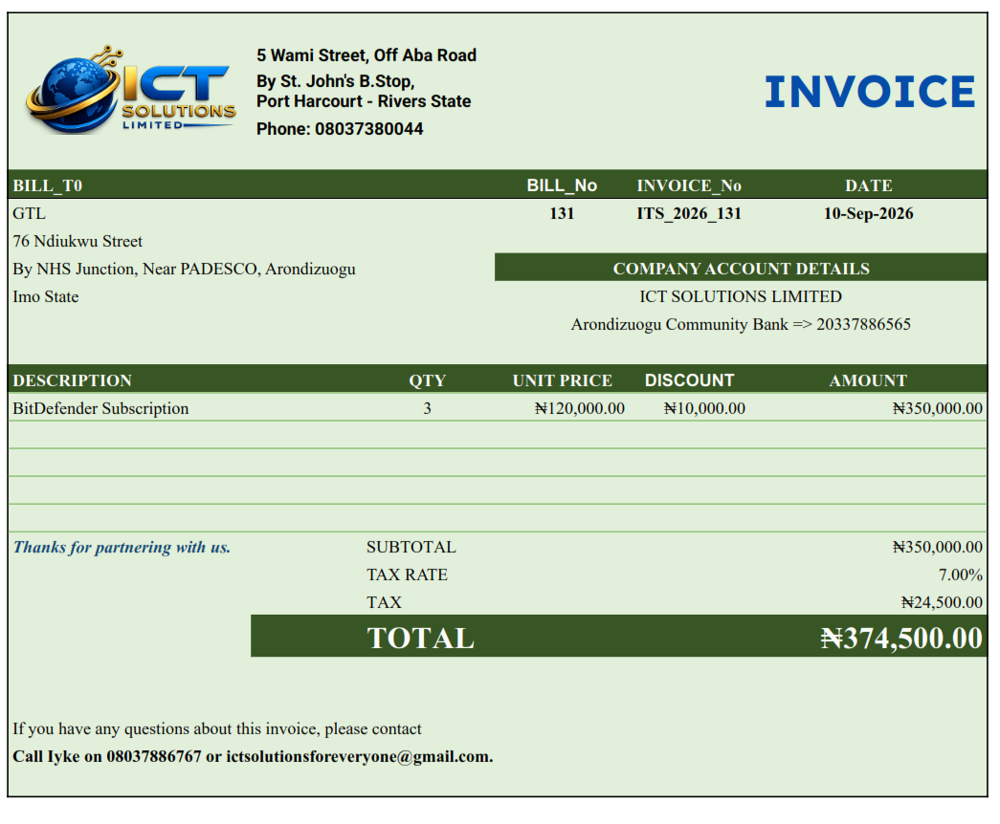

<!-- Badges with Clickable Link Destinations -->
[](./LICENSE)
[](https://developers.google.com/apps-script)
[](https://workspace.google.com/products/sheets/)
[](https://workspace.google.com/)

# ALTS-GoogleVersion: Automated Lifecycle Tracking System (Google Workspace Edition)

**ALTS-GoogleVersion** is an automated cloud billing and lifecycle tracking system built natively for Google Workspace using **Google Apps Script** and **Google Sheets**. 

The system automates client renewal monitoring, filters active subscription line items using dynamic target windows, calculates taxes/discounts, populates branded spreadsheet invoice templates, exports pixel-perfect PDF documents via native Sheet-to-PDF rendering, and archives audit-ready invoices directly to Google Drive while dispatching client notifications via Gmail.

---

## 📺 Video Tutorial & Visual Preview

### Full Video Walkthrough
Watch the complete setup, configuration, and execution demo on YouTube:
[](https://www.youtube.com/watch?v=YOUR_YOUTUBE_VIDEO_ID)
> *Click the thumbnail above or [watch the step-by-step video tutorial on YouTube](https://www.youtube.com/watch?v=YOUR_YOUTUBE_VIDEO_ID).*

---

### Invoice Output Preview
Below is a sample of the pixel-perfect PDF invoice generated automatically by the system:



---

## Key Features

- **Dynamic Renewal Monitoring**: Automatically parses client services and filters due renewals strictly within a defined `EmailDeterminant` window (`[-1, 2]` days).
- **Line-Item Level Granularity**: Filters individual subscription items per client rather than broadly billing entire client profiles.
- **Dynamic Sequence & Year Tracking**: Auto-increments invoice numbers (`ITS_YYYY_XXXX`) using dynamic system date resolution.
- **Pixel-Perfect PDF Generation**: Employs native Google Spreadsheet PDF exporting (`exportSheetToPdf`) to guarantee exact color preservation, logos, headers, fonts, and layout structure without CSS stripping.
- **Automated Archiving for Audits**: Automatically creates and maintains an `Invoices_Archive` folder in Google Drive to store historical PDF invoices for auditing.
- **Cell Protection Friendly**: Runs continuously under time-driven triggers even when critical formula ranges and sequence counters are protected from manual user edits.

---

## Spreadsheet Architecture & Data Schema

The system relies on four primary tabs within the master Google Sheet:

### 1. `SERVICES_TABLE`
Stores active subscription items and renewal tracking logic.
- **Col A**: `Client`
- **Col B**: `Service`
- **Col C**: `Cost`
- **Col F**: `ActiveStatus` (`Yes` / `No`)
- **Col J**: `EmailDeterminant` (Calculated integer days until renewal)
- **Col K**: `QTY`
- **Col L**: `Discount`

### 2. `CLIENTS_TABLE`
Contains client master metadata and dispatch tracking.
- **Col A**: `Client Name`
- **Col B**: `Email`
- **Col C**: `In_copy` (CC Email Addresses)
- **Col D–F**: `Address Line 1`, `Address Line 2`, `Address Line 3`
- **Col G**: `Invoice_No` (Updated dynamically by script)
- **Col H**: `Date` (Updated dynamically by script)

### 3. `SETTINGS`
Holds global configuration data.
- **Cell B1**: Master invoice sequential counter (e.g., `1000`).

### 4. `INVOICE_TEMPLATE`
A pre-formatted, styled spreadsheet canvas used as the template layout.
- **Header Metadata**: `A7` (Client Name), `A8:A10` (Address), `C7` (Bill No), `D7` (Invoice No), `F7` (Date).
- **Line Items Area**: Rows `14` to `18` (`A` = Description, `C` = QTY, `D` = Unit Price, `E` = Discount).
- **Formula Section**:
  - `AMOUNT` (`F14:F18`): `=IF(OR(D14="", A14=""), "", IF(ISNUMBER(C14), (C14*D14)-N(E14), D14-N(E14)))`
  - `SUBTOTAL` (`F19`): `=IF(F14="", "", SUM(F14:F18))`
  - `TAX RATE` (`F20`): `7.00%`
  - `TAX` (`F21`): `=IF(F19="", "", F19 * F20)`
  - `TOTAL` (`F22`): `=IF(F19="", "", F19 + F21)`

---

## Installation & Deployment Setup

1. **Create the Google Sheet**:
   - Set up the four tabs (`SERVICES_TABLE`, `CLIENTS_TABLE`, `SETTINGS`, `INVOICE_TEMPLATE`) according to the schema above.
   - Design and style `INVOICE_TEMPLATE` with your corporate branding, green canvas background, logos, and borders.

2. **Add Apps Script**:
   - In Google Sheets, navigate to **Extensions > Apps Script**.
   - Clear any existing code in `Code.gs` and paste the script provided in `Code.gs` in this repository.
   - Click **Save** (💾).

3. **Configure Range Protection (Optional but Recommended)**:
   - Protect cell `SETTINGS!B1` and formula cells on `INVOICE_TEMPLATE` (`F14:F22`).
   - Set permissions to **"Only You"**. The script will continue running without permission conflicts.

4. **Set Up Automated Daily Trigger**:
   - In the Apps Script editor, click **Triggers** (🕒 icon on the left menu).
   - Click **+ Add Trigger** (bottom right).
   - Configure:
     - **Function to run**: `processAndSendDueInvoices`
     - **Event source**: `Time-driven`
     - **Type of time based trigger**: `Day timer`
     - **Time of day**: Select desired schedule (e.g., *7am to 8am*).
   - Click **Save** and authorize permissions when prompted.

---

## Repository Structure

```text
ALTS-GoogleVersion/
├── README.md          # System documentation and setup guide
├── Code.gs            # Core Google Apps Script automation logic
├── GUIDE.md           # Visual step-by-step setup guide
└── assets/
    └── invoice_sample_preview.png  # Sample screenshot of generated invoice